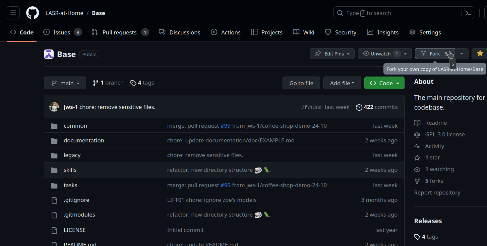
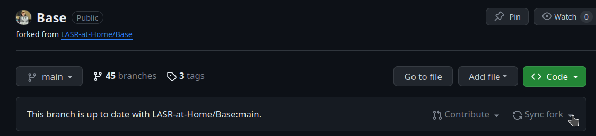

# Worksheet 1 - Getting Started
## Overview
This worksheet will get you setup with the LASR container and codebase, and get you ready to contribute!
## Objectives
- Setup the LASR container and your workspace.
- Create a fork of the repository.
- Understand contribution guidelines.
## The Container
### Installation
If you have not already acquired the container, you will need to build it yourself. In future, you will be able to simply pull it from NextCloud.
#### Building from Source
1. Install [Apptainer](https://apptainer.org/), instructions are available [here](https://apptainer.org/docs/admin/main/installation.html).
2. Pull the *base noetic container* from NextCloud:
```
wget https://nextcloud.nms.kcl.ac.uk/s/BZtWJtiyP57r8YN/download -O tiago_noetic_opensource.sif -q --show-progress
```
3. Clone the [Containers](https://github.com/LASR-at-Home/Containers) repository:
```
git clone git@github.com:LASR-at-Home/Containers.git
```
4. Build the container, bootstrapping from the *base noetic container*:
```
sudo apptainer build robocup_container.sif Containers/robocup_container.def
```
<!-- #### Pull from Nextcloud (coming soon) -->
<!-- ``` -->
<!-- wget https://nextcloud.nms.kcl.ac.uk/... -O robocup_container.sif -q --show-progress -->
<!-- ``` -->
### Usage
Whenever you want to use ROS, you **must** enter the container. Trying to run ROS code/commands outside of the container is a very common mistake. However, you can develop code outside of the container. You can enter the container natively as such:
```
apptainer run ~/robocup_container.sif
```
There are other configurations of running the container, which can be understood by running:
```
apptainer run-help ~/robocup_container.sif
```
### Aliases
It can be tedious to keep typing out `apptainer run...`, so it's useful and time-saving to create an alias in your `~/.bashrc`, for instance:
```
echo "alias robocup='sudo apptainer run ~/robocup_container.sif'" >> ~/.bashrc
source ~/.bashrc # note that this is done automatically when you launch future terminal instances.
```
## Creating a Workspace
1. Enter the container, e.g. using the alias you made above.
2. Create a workspace directory:
```
mkdir -p lasr_ws/src # you can call this anything, although convention is to suffix with "_ws"
```
3. Initialise the workspace:
```
cd lasr_ws
catkin_init_workspace
```
4. Build the workspace - although the workspace currently contains no packages, we can run a build to test that everything is setup properly.
```
catkin build
```
If successful, this should create `lasr_ws/build`, `lasr_ws/devel` and `lasr_ws/logs`.
## The Repository
The main LASR repository can be found [here](https://github.com/LASR-at-Home/Base), to familiarise yourself with the organisation of the repository we recommend studing the [README](https://github.com/LASR-at-Home/Base/blob/main/README.md). Understanding how things are structured will likely save you time later on when you are looking for a specific package/functionality.

### Contributing
Contributions to the repository are welcome and encouraged - this is a collaborative effort, and we hope to have as many people involved in developing the code base as possible. However, contributions **must** be made in-line with the [contributions guidline](https://github.com/LASR-at-Home/Base/blob/main/CONTRIBUTING.md) - so if you wish to contribute, it's recommended that you study this thoroughly to save yourself and others time and effort.

### Forking the Repsository
As mentioned in the contributions guideline, working in forks is required for non-collaborative efforts (where branches would be more suited). It's likely that most work will be done in silo, and integrated with other pieces of work in a larger collaborative effort. Therefore, having a fork of the repository is essential.

1. Navigate the [repository](https://github.com/LASR-at-Home/Base).
2. Create a fork. The owner should be you, and you may want to uncheck "copy the main branch only".

3. Clone your fork:
```
git clone git@github.com:<username>/Base.git ~/catkin_ws/src/lasr-base
```
### Maintaining your Fork
1. Check the current remotes
```
git remote
```
Running this should currently output a single remote, `origin` - this relates to your own **fork**.

2. Add the base repository as a remote
```
git remote add base git@github.com:LASR-at-Home/Base.git
```
3. Updating your remotes - this will run `git fetch <remote>` for each remote.
```
git remote update
```
4. Merging from a different remote. You may want to merge/rebase the latest changes from `base/main` into/onto `<your-fork>/main`:
```
git checkout main # main on origin
git <rebase/merge> base/main
```
5. You can also checkout the main branch on the original repository:
```
git checkout base/main
```

You can also keep your branches synced through the GitHub web interface, through the `Sync fork` button:




### Building
The repository ships many packages, which must be built as described above. You should now rebuild your workspace, and ensure that all packages build correctly. If you run into issues here, it is likely that you have failed to setup your environment correctly.

### Contributing through your fork
For contributions, we refer you back to the [contributions guidline](https://github.com/LASR-at-Home/Base/blob/main/CONTRIBUTING.md).

